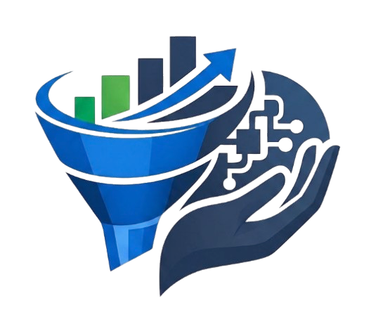
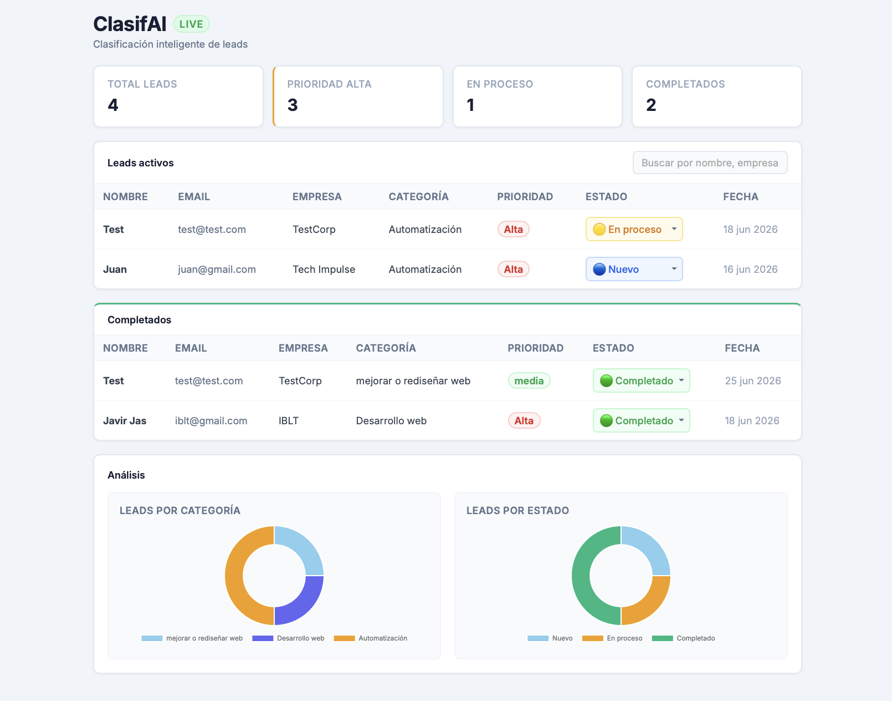
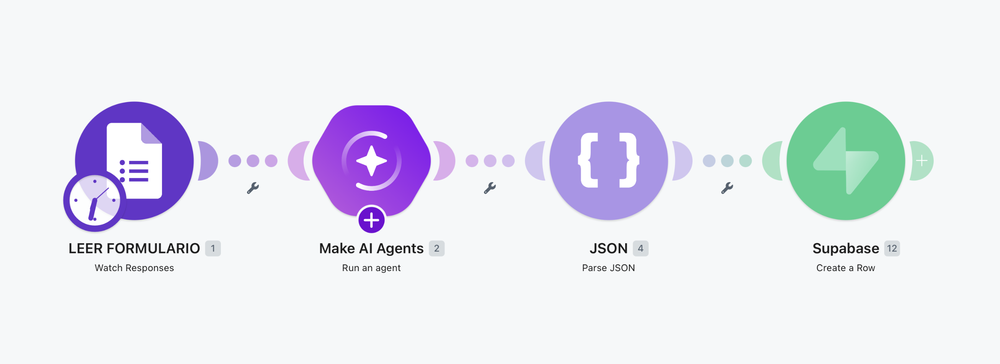
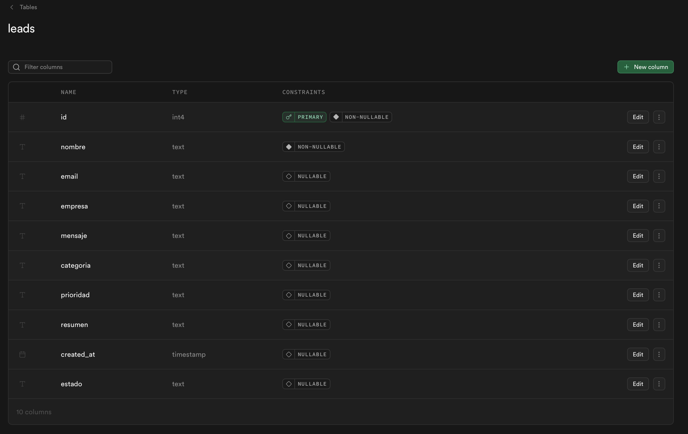

<p align="center">
  
</p>
<h1 align="center">ClasifAI</h1>
<p align="center">
  ClasifAI es una plataforma diseñada para automatizar la gestión de leads comerciales. 

  El sistema gestiona solicitudes mediante formularios y utiliza Inteligencia Artificial para analizar, clasificar y resumir según su importancia.
  Toda esta información se almacena en una base de datos PostgreSQL, permitiendo visualizar y gestionar los clientes potenciales en tiempo real a través de un dashboard web.
</p>


## Objetivos del proyecto

* Automatizar la clasificación de leads.
* Integrar modelos de IA dentro de flujos de automatización.
* Aplicar consultas SQL sobre datos reales.
* Diseñar una arquitectura moderna basada en herramientas No-Code y Low-Code.
* Construir un dashboard WEB conectado a una base de datos en tiempo real.

## Funcionalidades

* Captura automática de leads.
* Clasificación mediante IA.
* Generación de resúmenes automáticos.
* Almacenamiento estructurado en PostgreSQL.
* Dashboard de visualización.
* Actualización del estado de los leads.
* Consultas SQL para análisis de información.
* Integración completa entre servicios.

## Arquitectura

```text
Google Forms ➔ Make ➔ Make AI Agent ➔ JSON Parser ➔ Supabase (PostgreSQL) ➔ Dashboard Web (html - css - javaScript)
```

## Capturas

### Dashboard                                   
     

### Flujo de Make


### Supabase


## Flujo de funcionamiento

1. Un usuario completa un formulario de contacto.
2. **Make** detecta automáticamente una nueva respuesta.
3. El **Agente IA** analiza el contenido del lead.
4. La IA devuelve:
   * Categoría
   * Prioridad
   * Resumen
5. **Make** transforma la respuesta JSON.
6. Los datos se almacenan en **Supabase**.
7. El **dashboard** consulta la base de datos y muestra la información actualizada.

## Tecnologías utilizadas

### Automatización
* Make
* Google Forms
* Make AI Agents

### Base de datos
* Supabase
* PostgreSQL

### Frontend
* HTML5
* CSS3
* JavaScript

## Seguridad

El proyecto utiliza **Row Level Security (RLS)** en Supabase para controlar los permisos de acceso de manera estricta:

* **Lectura pública:** Configurada específicamente para el dashboard.
* **Inserciones:** Realizadas de forma segura mediante *Service Role* desde Make.
* **Actualización:** Controlada directamente desde la aplicación.

## Futuras mejoras

* Sistema de autenticación de usuarios.
* Gestión de roles y usuarios del sistema.
* Módulo de métricas avanzadas de conversión.
* Exportación de datos a formatos estándar (CSV/Excel).
* Integración nativa con CRM externos.
* Sistema de notificaciones automáticas (Email/Slack) ante leads críticos.
* Dashboard analítico e histórico avanzado.

## Autor
Amed Torres

**Este proyecto es público y se muestra con fines de portafolio.
El código no está autorizado para su reutilización, redistribución ni uso comercial.**
